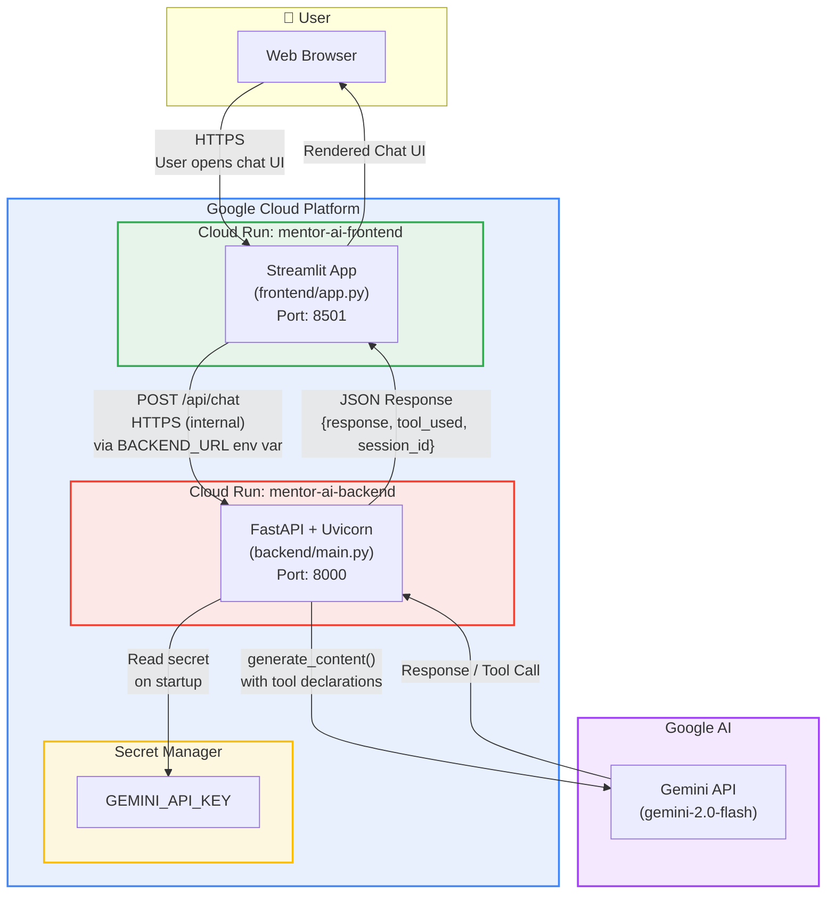

# Mentor AI Chatbot — GCP Cloud Run Architecture

## High-Level Diagram

## Flow Summary

1. **User** opens the Streamlit frontend URL in their browser
2. **Streamlit** (Cloud Run #1) renders the chat UI and sends user messages via `POST /api/chat` to the backend using the `BACKEND_URL` env var
3. **FastAPI** (Cloud Run #2) receives the request, loads `GEMINI_API_KEY` from Secret Manager, and calls the Gemini API with tool declarations
4. **Gemini** processes the message (optionally executing tool calls like `get_current_time`) and returns a response
5. **FastAPI** sends the JSON response back to Streamlit, which renders it in the chat UI
