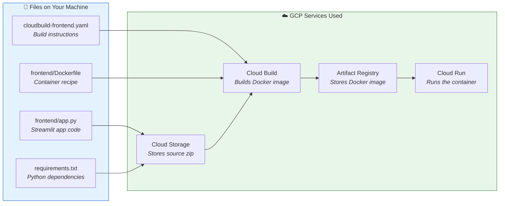

# Frontend Deployment Process — Step-by-Step

## End-to-End Deployment Flow

```mermaid
flowchart TD
    A["👨‍💻 Developer runs<br/><b>gcloud builds submit</b><br/>from local machine"] --> B["📦 Source code is zipped<br/>and uploaded to<br/><b>Cloud Storage</b> bucket<br/>(gs://mechaichat_cloudbuild/source/...)"]

    B --> C["🔨 <b>Cloud Build</b> picks up<br/>the build job using<br/><b>cloudbuild-frontend.yaml</b>"]

    C --> D["🐳 Cloud Build runs<br/><b>docker build</b><br/>using <b>frontend/Dockerfile</b>"]

    D --> D1["1️⃣ Pulls base image<br/><b>python:3.12-slim</b>"]
    D1 --> D2["2️⃣ Copies <b>requirements.txt</b><br/>and runs <b>pip install</b>"]
    D2 --> D3["3️⃣ Copies <b>frontend/</b><br/>source code into container"]
    D3 --> D4["4️⃣ Sets CMD to run<br/><b>streamlit run frontend/app.py</b><br/>on port $PORT"]

    D4 --> E["🏷️ Image is tagged as<br/><b>us-central1-docker.pkg.dev/<br/>mechaichat/mentor-ai/frontend:latest</b>"]

    E --> F["📤 Cloud Build pushes<br/>the image to<br/><b>Artifact Registry</b><br/>(mentor-ai repository)"]

    F --> G["👨‍💻 Developer runs<br/><b>gcloud run deploy</b><br/>mentor-ai-frontend"]

    G --> H["⚙️ Cloud Run pulls image<br/>from <b>Artifact Registry</b>"]

    H --> I["🔧 Cloud Run configures:<br/>• BACKEND_URL env var<br/>• 512Mi memory, 1 CPU<br/>• 0–3 instances<br/>• Allow unauthenticated"]

    I --> J["🚀 Cloud Run creates<br/><b>Revision</b><br/>(mentor-ai-frontend-00001-dj7)"]

    J --> K["🌐 Cloud Run routes<br/><b>100% traffic</b><br/>to new revision"]

    K --> L["✅ Service is live at<br/><b>https://mentor-ai-frontend-<br/>954088104521.us-central1.run.app</b>"]

    style A fill:#e3f2fd,stroke:#1565c0
    style B fill:#fff3e0,stroke:#e65100
    style C fill:#fff3e0,stroke:#e65100
    style D fill:#f3e5f5,stroke:#6a1b9a
    style D1 fill:#f3e5f5,stroke:#6a1b9a
    style D2 fill:#f3e5f5,stroke:#6a1b9a
    style D3 fill:#f3e5f5,stroke:#6a1b9a
    style D4 fill:#f3e5f5,stroke:#6a1b9a
    style E fill:#f3e5f5,stroke:#6a1b9a
    style F fill:#e8f5e9,stroke:#2e7d32
    style G fill:#e3f2fd,stroke:#1565c0
    style H fill:#e8f5e9,stroke:#2e7d32
    style I fill:#fff8e1,stroke:#f9a825
    style J fill:#fff8e1,stroke:#f9a825
    style K fill:#fff8e1,stroke:#f9a825
    style L fill:#c8e6c9,stroke:#1b5e20,stroke-width:3px
```



## What Each Step Does

### Phase 1 — Build the Docker Image (Cloud Build)

| Step | Command / Action | What Happens |
|------|-----------------|--------------|
| 1 | `gcloud builds submit --config cloudbuild-frontend.yaml .` | Your entire project source is zipped and uploaded to a Cloud Storage bucket |
| 2 | Cloud Build reads `cloudbuild-frontend.yaml` | It finds the build instructions — which Dockerfile to use and what to tag the image |
| 3 | `docker build -f frontend/Dockerfile .` | Cloud Build runs Docker in the cloud (not on your machine) |
| 4 | Dockerfile executes | Installs Python 3.12, pip installs dependencies, copies frontend code |
| 5 | Image is tagged | `us-central1-docker.pkg.dev/mechaichat/mentor-ai/frontend:latest` |
| 6 | Image is pushed | Stored in **Artifact Registry** under the `mentor-ai` repository |

### Phase 2 — Deploy to Cloud Run

| Step | Command / Action | What Happens |
|------|-----------------|--------------|
| 7 | `gcloud run deploy mentor-ai-frontend --image ...` | Tells Cloud Run to create a new service using the built image |
| 8 | Cloud Run pulls the image | Downloads the container from Artifact Registry |
| 9 | Environment configured | `BACKEND_URL`, memory, CPU, scaling limits are set |
| 10 | Revision created | A new immutable version of the service is created |
| 11 | Traffic routed | 100% of traffic goes to the new revision |
| 12 | URL assigned | Service is publicly accessible at the Cloud Run URL |

## Key Files Involved



## Exact Commands Used

```bash
# STEP 1: Build and push the image using Cloud Build
gcloud builds submit --config cloudbuild-frontend.yaml .

# STEP 2: Deploy the image to Cloud Run
gcloud run deploy mentor-ai-frontend \
  --image us-central1-docker.pkg.dev/mechaichat/mentor-ai/frontend:latest \
  --region us-central1 \
  --platform managed \
  --allow-unauthenticated \
  --set-env-vars "BACKEND_URL=https://mentor-ai-backend-954088104521.us-central1.run.app" \
  --memory 512Mi \
  --cpu 1 \
  --min-instances 0 \
  --max-instances 3
```
